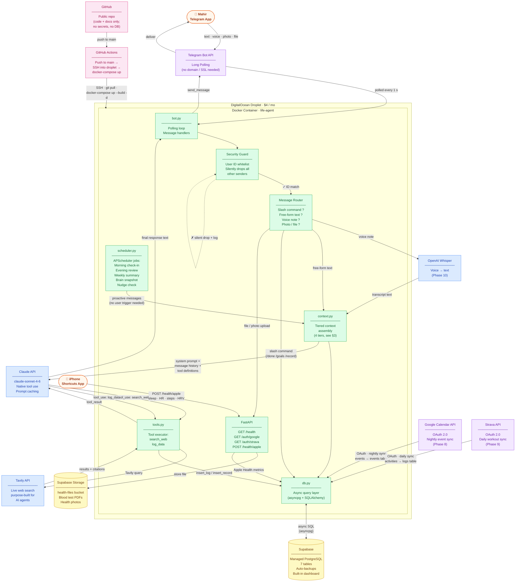
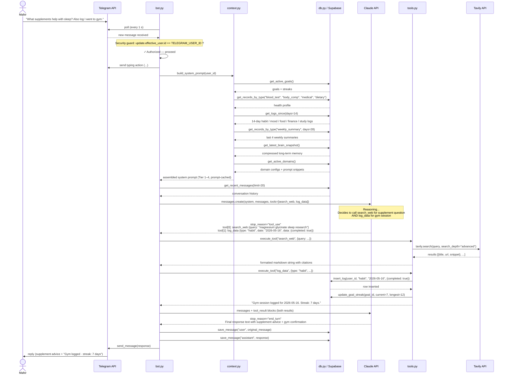
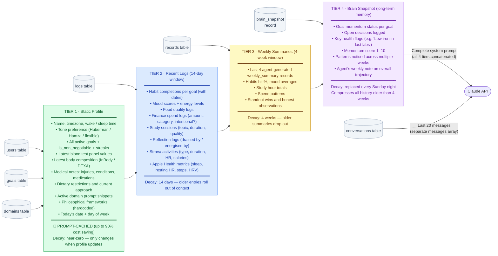
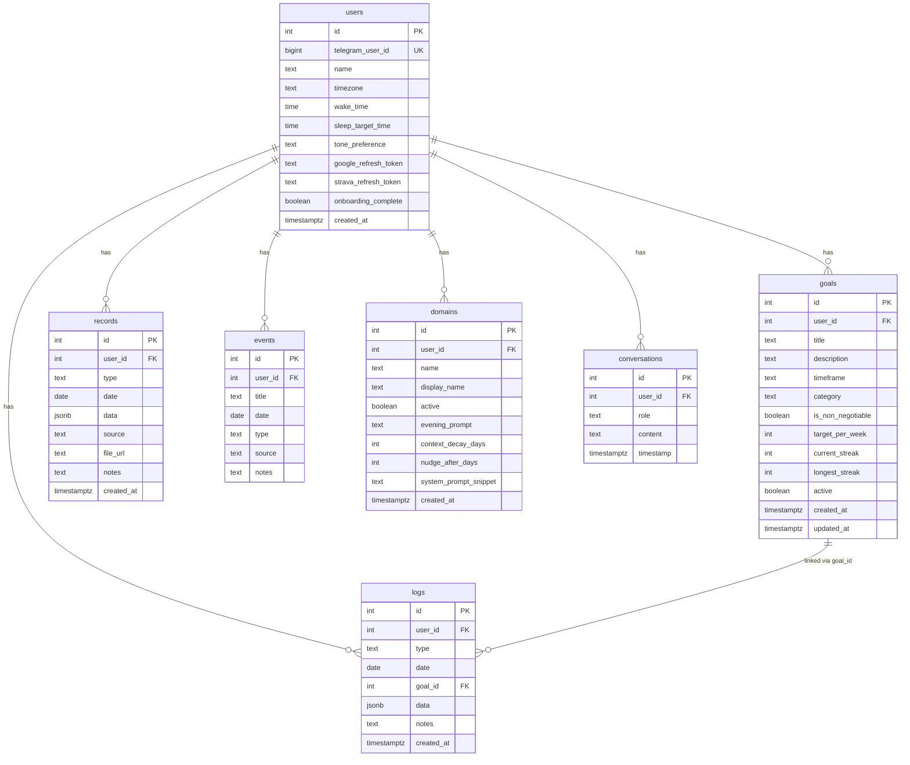
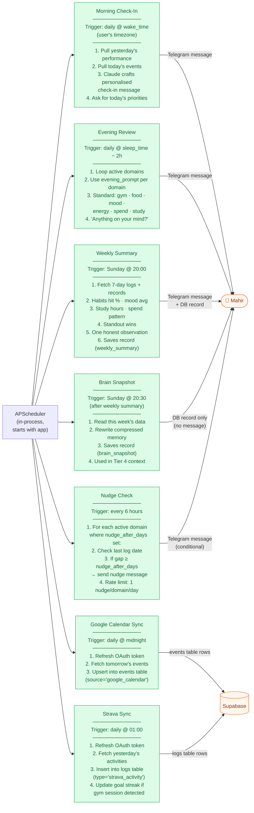
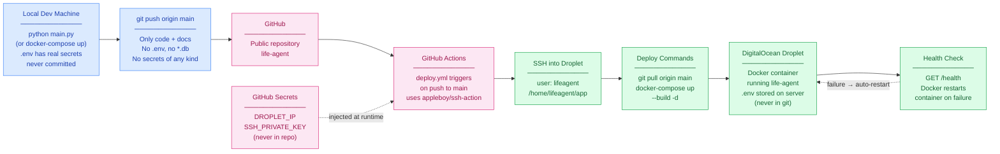

# Life Agent — Architecture Diagrams

> Last updated: April 2026. All diagrams reflect the final planned architecture.

---

## 1. System Overview

All components and their connections across the full stack.



---

## 2. Free-Form Message Flow

Step-by-step sequence for a typical free-form message that triggers both web search and a data write.



---

## 3. Context Tiers

What gets assembled into the Claude system prompt on every call.



---

## 4. Database Schema

Entity-relationship diagram for all 7 tables.



**`logs.type` values:** `habit` · `mood` · `food` · `finance` · `study` · `social` · `reflection` · `strava_activity` · `health_metric`

**`records.type` values:** `blood_test` · `body_comp` · `medical` · `dietary` · `decision` · `weekly_summary` · `brain_snapshot`

**`events.source` values:** `manual` · `google_calendar`

**`logs.data` JSONB examples:**
```json
habit:      { "goal_id": 3, "completed": true }
mood:       { "score": 7, "energy": 6 }
food:       { "description": "chicken rice veg", "quality": 8 }
finance:    { "amount": 45, "category": "food delivery", "intentional": false }
study:      { "topic": "CFA Fixed Income", "duration_min": 90, "quality": "focused" }
reflection: { "drained_by": "...", "energised_by": "...", "on_mind": "..." }
strava:     { "name": "Morning Run", "type": "Run", "duration_sec": 2700,
              "distance_m": 5000, "average_heartrate": 152, "calories": 380 }
health:     { "sleep_hours": 7.2, "resting_hr": 58, "steps": 9400, "hrv": 42 }
```

---

## 5. Scheduler Jobs

Proactive message cadence — no user action required.



---

## 6. CI/CD Pipeline


