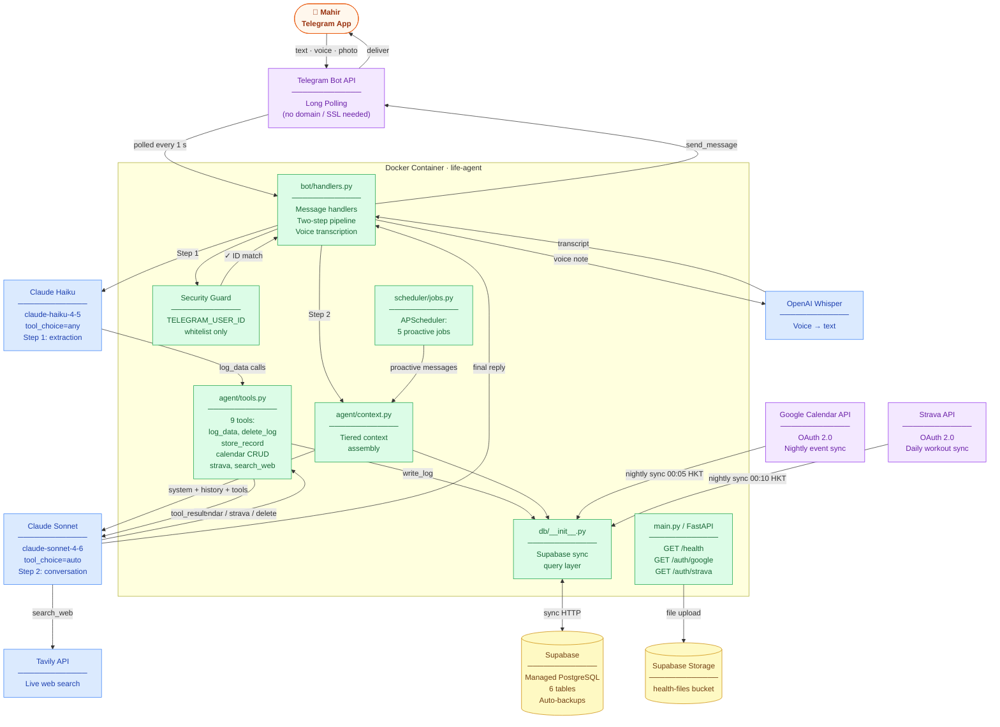
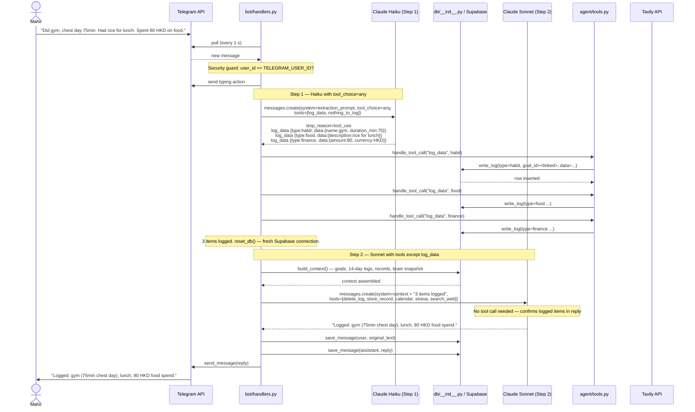
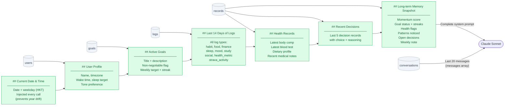
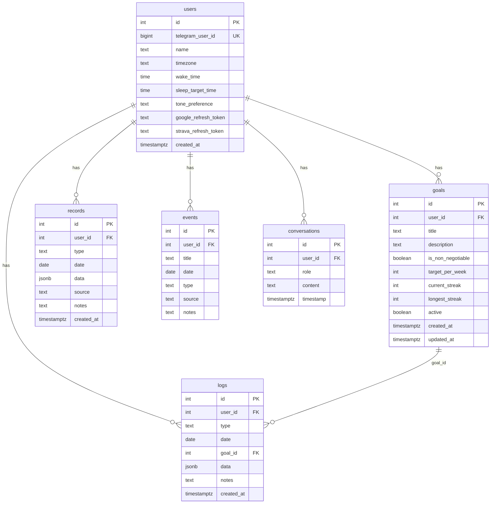
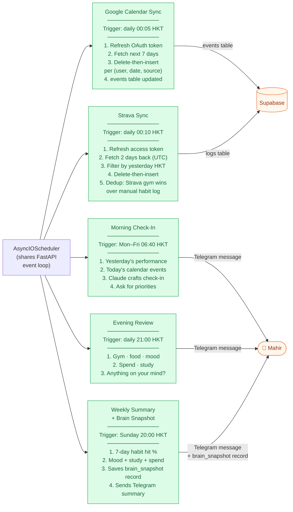

# Life Agent — Architecture Diagrams

> Last updated: May 2026. Diagrams reflect the current implemented architecture (Phases 0–10 complete).

---

## 1. System Overview



---

## 2. Two-Step Message Flow

Detailed sequence for a free-form message through the extraction + conversation pipeline.



---

## 3. Context Assembly

What gets injected into the Sonnet system prompt on every Step 2 call.



---

## 4. Database Schema



**`logs.type`:** `habit` · `mood` · `food` · `finance` · `study` · `social` · `strava_activity` · `health_metric`

**`records.type`:** `blood_test` · `body_comp` · `medical` · `dietary` · `decision` · `brain_snapshot`

**`events.source`:** `manual` · `google_calendar`

---

## 5. Scheduler Jobs

Five APScheduler jobs running inside the FastAPI process (same event loop).



---

## 6. Goal ID Auto-Linking

When Haiku logs a `habit`, `handle_tool_call` automatically links it to the matching goal.

```
log_data called with type=habit, data={name: "gym"}
    |
    v
get_goal_by_name(user_id, "gym")
    — fuzzy match: name_lower in goal.title.lower()
    |
    +--> match found  → write_log(..., goal_id=goal["id"])
    |                   Strava dedup and streak logic can now find this log
    |
    +--> no match     → write_log(..., goal_id=None)
                        stored but not linked to streak tracking
```

This means dense voice notes ("did gym, took creatine, went for a run") are correctly linked to their goals without any manual input.
